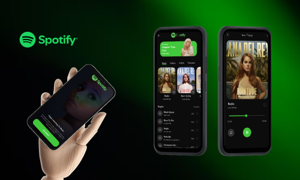

# 🎵 Spotify Clone

A Spotify-inspired music streaming application built with **Flutter**. This project was created for learning and practicing Flutter application development, state management, audio playback, clean architecture, and modern UI development.

<p align="center">
  
</p>

## 🛠️ Technologies Used

* **Flutter**
* **Dart**
* **BLoC / Cubit** for state management
* **just_audio** for audio playback
* **Hydrated BLoC** for persistent state
* **GetIt** for dependency injection
* **JSON** for local song data
* **Flutter Assets** for local music and cover images

## 🏗️ Architecture

The project follows a **Clean Architecture** approach to keep the application organized and maintainable.

```text
lib/
├── common/
│   ├── helpers/
│   └── widgets/
│
├── core/
│   ├── configs/
│   └── usecase/
│
├── data/
│   ├── models/
│   ├── repositories/
│   └── sources/
│
├── domain/
│   ├── entities/
│   ├── repositories/
│   └── usecases/
│
└── presentation/
    ├── home/
    ├── song_player/
    └── ...
```

## 🎶 Song Data

Song information is currently loaded from a local JSON file rather than an online database.

```text
assets/
├── data/
│   └── songs.json
│
├── images/
│   └── ...
│
└── songs/
    └── ...
```

Using local data and assets makes the project easier to run during development without requiring an external backend service.

## 🚀 Getting Started

### Prerequisites

Make sure you have the following installed:

* Flutter SDK
* Dart SDK
* Android Studio or VS Code
* Android Emulator or a physical Android device

### Installation

Clone the repository:

```bash
git clone https://github.com/chaaanuwu/spotify_clone.git
```

Navigate to the project directory:

```bash
cd spotify_clone
```

Install dependencies:

```bash
flutter pub get
```

Configure Firebase using FlutterFire:
```bash
flutterfire configure
```

Run the application:

```bash
flutter run
```

## 🎯 Learning Goals

This project was built to gain practical experience with:

* Flutter UI development
* State management with BLoC/Cubit
* Clean Architecture
* Dependency injection
* Audio playback
* Local JSON data handling
* Asset management
* Persistent application state
* Building reusable Flutter widgets
* Structuring a scalable Flutter application

## ⚠️ Disclaimer

This project is an **unofficial Spotify-inspired application** created for educational and learning purposes.
It is not affiliated with, endorsed by, or connected to Spotify.
Spotify and its related branding are trademarks of their respective owners.

## 👨‍💻 Author

**Chanuka Senevirathne**

* GitHub: [chaaanuwu](https://github.com/chaaanuwu)
* LinkedIn: [chaaanuwu](https://linkedin.com/in/chaaanuwu)

---

⭐ If you found this project useful, consider giving it a star!
